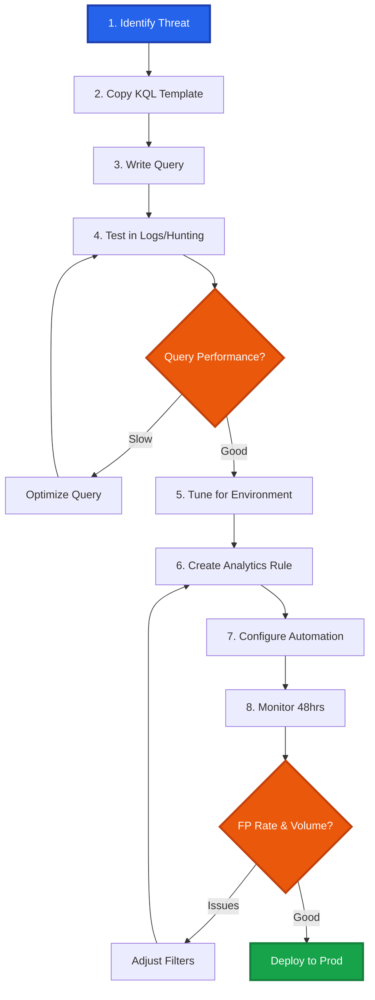

# Microsoft Defender KQL Detection Library

<div align="center">


[](https://azure.microsoft.com/services/azure-sentinel/)
[](https://attack.mitre.org/)

**Enterprise KQL Detection Rules for Microsoft Security Stack**

*Curated by Mathan | Senior Security Engineer*

[🚀 Quick Start](#-quick-start) • [📁 Categories](#-detection-categories) • [📖 Documentation](#-detection-engineering-workflow) • [🤝 Contributing](#-contributing)

<!-- SEO: Microsoft Defender detection rules, KQL queries, Azure Sentinel analytics, threat detection, M365 security, advanced hunting queries, Kusto query language, security analytics, cloud security detection, identity threat detection, Microsoft 365 Defender, endpoint detection, email security rules, MITRE ATT&CK Microsoft, detection engineering, SOC automation, threat hunting KQL, Azure AD security, Office 365 security, incident detection, security operations, KQL analytics -->

</div>

---

## 📋 Overview

Production-tested **KQL (Kusto Query Language)** detection rules for Microsoft's integrated security platform, covering endpoint, identity, email, and cloud threats.

✅ **Multi-platform** - Defender XDR, Defender for Endpoint, Azure Sentinel  
✅ **Cloud-native** - Optimized for M365 and Azure environments  
✅ **Identity-focused** - Azure AD and OAuth attack detection  
✅ **Automated** - Ready for analytics rules and Logic Apps  
✅ **MITRE-aligned** - Comprehensive ATT&CK coverage  

### Who This Is For

| Role | Use Case |
|------|----------|
| **Detection Engineers** | Build KQL analytics rules |
| **SOC Analysts** | Investigate Microsoft Defender/Sentinel alerts |
| **Cloud Security Teams** | Detect Azure/M365 threats |
| **Threat Hunters** | Proactive hunting in cloud environment |

### Supported Platforms

| Platform | Tables | Primary Use Cases |
|----------|--------|-------------------|
| **Microsoft Defender XDR** | Device*, Email*, Identity* | Endpoint, Email, Identity |
| **Defender for Endpoint** | DeviceProcessEvents, DeviceFileEvents | Endpoint threats |
| **Azure Sentinel** | SigninLogs, AuditLogs, AzureActivity | Cloud security, Identity |
| **Defender for Cloud Apps** | CloudAppEvents | SaaS security |

---

## 📁 Detection Categories

**8 categories** optimized for Microsoft's security ecosystem:

<table>
<tr>
<td width="25%" align="center">
<h3>🔐 Authentication</h3>
<b>Identity Attack Detection</b><br/>
<sub>Impossible Travel • Password Spray • MFA</sub>
</td>
<td width="25%" align="center">
<h3>💻 Endpoint</h3>
<b>Defender for Endpoint</b><br/>
<sub>Malware • LOLBins • Process Injection</sub>
</td>
<td width="25%" align="center">
<h3>🌐 Network</h3>
<b>Network Anomalies</b><br/>
<sub>C2 • Suspicious Connections</sub>
</td>
<td width="25%" align="center">
<h3>☁️ Cloud</h3>
<b>Azure & M365 Security</b><br/>
<sub>Privilege Escalation • API Abuse</sub>
</td>
</tr>
<tr>
<td width="25%" align="center">
<h3>📧 Mail</h3>
<b>Defender for Office 365</b><br/>
<sub>Phishing • BEC • Email Rules</sub>
</td>
<td width="25%" align="center">
<h3>🌍 Web</h3>
<b>Browser & Web Threats</b><br/>
<sub>Drive-by Downloads • Malicious Extensions</sub>
</td>
<td width="25%" align="center">
<h3>📊 Data</h3>
<b>DLP & Exfiltration</b><br/>
<sub>Cloud Storage • Mass Downloads</sub>
</td>
<td width="25%" align="center">
<h3>👤 Identity</h3>
<b>Azure AD & IAM</b><br/>
<sub>OAuth Abuse • Role Changes</sub>
</td>
</tr>
</table>

---

## 🚀 Quick Start

### Prerequisites

**Minimum Licenses:**
- Microsoft 365 E5 / A5, OR
- Microsoft Defender for Endpoint Plan 2 +
- Azure AD Premium P2

**Recommended:**
- Microsoft Defender XDR (includes MDE, MDO, MDCA, MDI)
- Azure Sentinel

**Data Retention Configuration:**
- SigninLogs: 90 days
- DeviceEvents: 30 days
- EmailEvents: 90 days


### Test a Detection

**In Defender XDR:**
1. Navigate to https://security.microsoft.com
2. Go to **Hunting** → **Advanced Hunting**
3. Copy query from any `.kql` file
4. Run query

**In Azure Sentinel:**
1. Navigate to https://portal.azure.com → **Sentinel** workspace
2. Go to **Logs**
3. Paste and run KQL query

### Deploy as Analytics Rule

**Defender XDR:**
1. **Settings** → **Microsoft 365 Defender** → **Detection rules**
2. Click **+ Create detection rule**
3. Configure:
   - **KQL Query:** [paste query]
   - **Frequency:** Every 5 minutes
   - **Severity:** High/Medium/Low
   - **MITRE:** T#### mapping
4. Save and enable

**Azure Sentinel:**
1. **Analytics** → **+ Create** → **Scheduled query rule**
2. Configure:
   - **Query:** [paste KQL]
   - **Run frequency:** 5 minutes
   - **Lookup period:** 5 minutes
   - **Alert threshold:** > 0 results
   - **Grouping:** By UserPrincipalName/DeviceId
3. Set incident creation settings
4. Enable rule

---

## 📖 Detection Engineering Workflow

### Complete Development Lifecycle



### 1. Identify the Threat

Focus on cloud and identity-centric threats:

**High-value techniques for Microsoft stack:**
- **T1078** - Valid Accounts (impossible travel)
- **T1566** - Phishing (email-based)
- **T1098** - Account Manipulation (Azure AD)
- **T1059** - Command Execution (PowerShell)

### 2. Copy the Template

```bash
# Standard Production Alert (MITRE Aligned)
cp templates/TEMPLATE_Standard_Alert.kql Authentication/T1078_Impossible_Travel.kql

# Threat Hunting Hypothesis
cp templates/TEMPLATE_Threat_Hunting.kql Authentication/Hunt_T1078_Anomalies.kql

# Time-Series Anomaly Detection
cp templates/TEMPLATE_Anomaly_Detection.kql Authentication/T1078_Baseline_Deviation.kql
```

### 3. Write the KQL Query

Leverage Microsoft's rich telemetry tables:

```kql
let timeframe = 24h;
let distance_threshold = 500; // km
let time_threshold = 60; // minutes
SigninLogs
| where TimeGenerated >= ago(timeframe)
| where ResultType == "0"  // Successful sign-in
| project 
    TimeGenerated,
    UserPrincipalName,
    IPAddress,
    Location,
    LocationDetails,
    DeviceDetail,
    AppDisplayName
| extend 
    Country = tostring(LocationDetails.countryOrRegion),
    City = tostring(LocationDetails.city),
    Latitude = todouble(LocationDetails.geoCoordinates.latitude),
    Longitude = todouble(LocationDetails.geoCoordinates.longitude)
| where isnotempty(Latitude) and isnotempty(Longitude)
| order by UserPrincipalName, TimeGenerated asc
| serialize
| extend 
    prev_location = prev(City),
    prev_time = prev(TimeGenerated),
    prev_lat = prev(Latitude),
    prev_lon = prev(Longitude)
| where UserPrincipalName == prev(UserPrincipalName)
| extend 
    time_diff_hours = datetime_diff('hour', TimeGenerated, prev_time),
    // Haversine distance calculation
    lat_diff = radians(Latitude - prev_lat),
    lon_diff = radians(Longitude - prev_lon),
    a = pow(sin(lat_diff / 2), 2) +
        cos(radians(prev_lat)) * cos(radians(Latitude)) *
        pow(sin(lon_diff / 2), 2),
    distance_km = 12742 * asin(sqrt(a))
| where time_diff_hours > 0 and distance_km > distance_threshold
| extend speed_kmh = distance_km / time_diff_hours
| where speed_kmh > 800  // Faster than commercial flight
| extend
    RiskLevel = case(
        speed_kmh > 2000, "CRITICAL",
        speed_kmh > 1000, "HIGH",
        "MEDIUM"
    )
| project 
    TimeGenerated,
    UserPrincipalName,
    CurrentLocation = strcat(City, ", ", Country),
    PreviousLocation = prev_location,
    TimeDiff_Hours = time_diff_hours,
    Distance_KM = round(distance_km, 2),
    Speed_KMH = round(speed_kmh, 2),
    Risk = RiskLevel
```

<details>
<summary><b>💡 KQL Best Practices</b></summary>

**Performance Optimization: `where` vs `search` & `has` vs `contains`**

| Feature | Best Practice (Fast) | Anti-Pattern (Slow) |
| :--- | :--- | :--- |
| **Filtering** | `where` (Schema-aware) | `search` (Full text scan) |
| **String Match** | `has` (Indexed token match) | `contains` (Substring scan) |
| **Case Sensitivity** | `==` (Case-sensitive) | `=~` (Case-insensitive - slower) |
| **Order of Ops** | Filter Time -> Filter Fields -> Project | Project -> Summarize -> Filter |

**Recommendation:** Always filter by `TimeGenerated` first, then by specific indexed columns (e.g., `DeviceName`, `FileName`). Use `has` for whole words and `contains` only when necessary.

```kql
// ✅ GOOD - Filter early, use indexed operators
SigninLogs
| where TimeGenerated >= ago(1h)
| where AppDisplayName has "Office"
| where ResultType == "0"

// ❌ AVOID - Filter late, use expensive scans
SigninLogs
| search "Office"
| where ResultType =~ "0"
| where TimeGenerated >= ago(1h)
```

**Use Materialized Views:**
```kql
// Create for frequently used datasets
.create-or-alter materialized-view SuccessfulSignins on table SigninLogs
{
    SigninLogs
    | where ResultType == "0"
    | summarize count() by UserPrincipalName, bin(TimeGenerated, 1h)
}
```

</details>

### 4. Test with Historical Data

```kql
// Test query performance and results
let startTime = now(-30d);
let endTime = now();
SigninLogs
| where TimeGenerated between (startTime .. endTime)
| [your detection logic]
| take 1000  // Limit for testing
```

**Validation:**
- Query completes in < 60 seconds
- Results match expected threat pattern
- No syntax errors
- Critical fields are populated

### 5. Tune for Your Environment

```kql
// Exclude service accounts
| where UserPrincipalName !endswith "svc.contoso.com"
| where UserPrincipalName !startswith "svc_"

// Exclude known safe applications
| where AppDisplayName !in ("Azure Portal", "Microsoft Teams", "Office 365")

// Exclude VPN IP ranges
| where IPAddress !startswith "10.100."
| where IPAddress !in ("52.168.117.170", "40.71.13.222")

// Adjust for tenant size
| where failed_count > 20  // Increased threshold for large tenant
```

**Target:** <5% false positive rate, <10 alerts/day per rule

### 6. Create Analytics Rule

**Configure Rule Settings:**
- **Frequency:** Every 5-15 minutes
- **Lookup period:** 5-15 minutes (match frequency)
- **Alert grouping:** Group by UserPrincipalName or DeviceId
- **Incident creation:** Single alert = Single incident

### 7. Configure Automation  

**Logic Apps / Playbooks:**
```kql
// Add enrichment fields for automation
| extend 
    IncidentTitle = strcat("Impossible Travel: ", UserPrincipalName),
    AlertSeverity = "High",
    MITRE_Technique = "T1078",
    Tactics = "Initial Access, Credential Access",
    AutomationAction = case(
        RiskLevel == "CRITICAL", "Block_User",
        RiskLevel == "HIGH", "Notify_Manager",
        "Log_Only"
    )
```

**Common Automation Actions:**
- Send Teams/Email notification
- Create ServiceNow ticket
- Revoke user sessions (high confidence)
- Force MFA re-authentication
- Block sign-ins temporarily

### 8. Monitor & Optimize

```kql
// Alert volume tracking
SecurityAlert
| where TimeGenerated >= ago(30d)
| where AlertName has "Impossible Travel"
| summarize Count=count() by bin(TimeGenerated, 1d)
| render timechart

// False positive analysis
SecurityIncident
| where TimeGenerated >= ago(30d)
| where Title has "Impossible Travel"
| where Classification == "FalsePositive"
| summarize FP_Count=count() by bin(TimeGenerated, 1d)
```

---

## 🎓 KQL Language Primer

### Query Structure

```kql
TableName
| where [filter conditions]
| extend [new columns]
| summarize [aggregations] by [grouping], bin(TimeGenerated, 1h)
| project [select columns]
| order by [sort columns]
| take/limit [row count]
```

### Essential Tables

| Table | Data Source | Common Use Cases |
|-------|-------------|------------------|
| `SigninLogs` | Azure AD | Authentication attacks, impossible travel |
| `DeviceProcessEvents` | MDE | Process execution, command lines |
| `DeviceNetworkEvents` | MDE | Network connections, C2 detection |
| `EmailEvents` | MDO | Phishing, BEC, email threats |
| `CloudAppEvents` | MDCA | SaaS app activity, file operations |
| `IdentityLogonEvents` | MDI | On-prem AD authentication |
| `AuditLogs` | Azure AD | Role changes, privilege escalation |
| `AzureActivity` | Azure | Resource operations, misconfigurations |

### Common KQL Operators

**Filtering:**
```kql
| where UserName == "admin"
| where IPAddress startswith "192.168."
| where ProcessName has "powershell"
| where FileSize between (1000 .. 10000)
| where UserName in~ ("Admin", "ADMIN", "admin")  // Case-insensitive
```

**String Functions:**
```kql
| extend Domain = split(UserPrincipalName, "@")[1]
| extend FileName = split(FilePath, "\\\\")[-1]
| extend IsAdmin = iff(UserName contains "admin", "Yes", "No")
```

**Aggregations:**
```kql
| summarize count() by UserName
| summarize UniqueIPs=dcount(IPAddress) by UserName
| summarize arg_max(TimeGenerated, *) by UserName  // Latest record
| summarize make_set(IPAddress) by UserName  // Unique list
```

**Time Operations:**
```kql
| where TimeGenerated >= ago(24h)
| extend TimeDiff = datetime_diff('minute', now(), TimeGenerated)
| bin(TimeGenerated, 1h)  // Round to hour
```

### Detection Patterns

<details>
<summary><b>Password Spray Attack</b></summary>

```kql
SigninLogs
| where TimeGenerated >= ago(1h)
| where ResultType != "0"  // Failed sign-ins
| summarize 
    FailedAttempts=count(),
    UniqueUsers=dcount(UserPrincipalName),
    Users=make_set(UserPrincipalName)
    by IPAddress, bin(TimeGenerated, 5m)
| where UniqueUsers > 10  // Same IP, many different users
| where FailedAttempts > UniqueUsers * 2
| extend RiskLevel = "HIGH"
```

</details>

<details>
<summary><b>Suspicious PowerShell Execution</b></summary>

```kql
DeviceProcessEvents
| where TimeGenerated >= ago(1h)
| where FileName =~ "powershell.exe"
| where ProcessCommandLine has_any ("-encodedcommand", "-enc", "IEX", "Invoke-Expression")
| where ProcessCommandLine !has "WindowsAzure"  // Exclude Azure agent
| project 
    TimeGenerated,
    DeviceName,
    AccountName,
    ProcessCommandLine,
    InitiatingProcessFileName
```

</details>

<details>
<summary><b>Azure AD Privilege Escalation</b></summary>

```kql
AuditLogs
| where TimeGenerated >= ago(1h)
| where OperationName has_any ("Add member to role", "roleAssignments/write")
| where Result == "success"
| extend RoleName = tostring(TargetResources[0].modifiedProperties[1].newValue)
| where RoleName has_any ("Global Administrator", "Privileged", "Company Administrator")
| extend Actor = tostring(InitiatedBy.user.userPrincipalName)
| project TimeGenerated, Actor, OperationName, RoleName, TargetUser=tostring(TargetResources[0].userPrincipalName)
```

</details>

---

## 📊 Advanced Analytics Features

### Multi-Table Joins

```kql
// Correlate sign-in with subsequent suspicious process
SigninLogs
| where TimeGenerated >= ago(1h)
| where LocationDetails.countryOrRegion in~ ("CN", "RU")
| project SigninTime=TimeGenerated, UserPrincipalName, Country=tostring(LocationDetails.countryOrRegion)
| join kind=inner (
    DeviceProcessEvents
    | where TimeGenerated >= ago(1h)
    | where FileName =~ "powershell.exe"
    | project ProcessTime=TimeGenerated, AccountName, ProcessCommandLine, DeviceName
) on $left.UserPrincipalName == $right.AccountName
| where datetime_diff('minute', ProcessTime, SigninTime) between (0 .. 60)
```

### Time Series Anomaly Detection

```kql
SigninLogs
| where TimeGenerated >= ago(30d)
| make-series Count=count() on TimeGenerated step 1h by UserPrincipalName
| extend Anomalies=series_decompose_anomalies(Count, 1.5)
| mv-expand TimeGenerated, Count, Anomalies
| where Anomalies != 0
| project TimeGenerated, UserPrincipalName, Count, Anomaly_Score=Anomalies
```

### Watchlists Integration

```kql
// Use Sentinel watchlists for IOCs
_GetWatchlist('HighRiskIPs')
| project SearchKey
| join kind=inner (
    SigninLogs
    | where TimeGenerated >= ago(1h)
) on $left.SearchKey == $right.IPAddress
```

---

## 🧪 Testing & Validation

### Attack Simulator

Use Microsoft Defender's built-in attack simulation:

1. **Microsoft 365 Defender** → **Endpoints** → **Evaluation & tutorials**
2. Select test scenario (e.g., "Suspicious PowerShell")
3. Run simulation on test endpoint
4. Verify your KQL detection triggers

### Validation Checklist

- [ ] Query executes without errors
- [ ] Results match threat pattern
- [ ] Execution time < 60 seconds
- [ ] False positive rate < 5%
- [ ] Analytics rule creates incidents correctly
- [ ] Automated actions trigger as expected
- [ ] Alert fields populated for investigation

---

## 📈 Detection Performance Monitoring

### Alert Volume Dashboard

```kql
SecurityAlert
| where TimeGenerated >= ago(30d)
| summarize AlertCount=count() by AlertName, bin(TimeGenerated, 1d)
| render timechart
```

### Query Performance Tracking

```kql
// In Azure Sentinel
Usage
| where TimeGenerated >= ago(7d)
| where DataType == "SecurityAlert"
| summarize TotalMB=sum(Quantity) by bin(TimeGenerated, 1h), Solution
| render timechart
```

### False Positive Analysis

```kql
SecurityIncident
| where TimeGenerated >= ago(30d)
| extend IsFP = iff(Classification == "FalsePositive", 1, 0)
| summarize FPCount=sum(IsFP), TotalCount=count() by Title
| extend FPRate = round(100.0 * FPCount / TotalCount, 2)
| where FPRate > 5
| order by FPRate desc
```

---

## 🤝 Contributing

### Contribution Guidelines

1. Fork repository
2. Create feature branch
3. Add detection using template
4. Test in Microsoft environment
5. Document results
6. Submit Pull Request

### Requirements

✅ **Template compliance** - Use `TEMPLATE_Standard_Alert.kql` for production rules  
✅ **Testing in Defender/Sentinel**  
✅ **Test results** (TP/FP rate, query time)  
✅ **Environment documentation**  
✅ **Screenshots**  
✅ **MITRE ATT&CK mapping**  

---

## 📚 Resources

### Microsoft Documentation
- [KQL Quick Reference](https://docs.microsoft.com/azure/data-explorer/kql-quick-reference)
- [Advanced Hunting Schema](https://docs.microsoft.com/microsoft-365/security/defender/advanced-hunting-schema-tables)
- [Azure Sentinel KQL](https://docs.microsoft.com/azure/sentinel/hunting)
- [MustLearnKQL](https://aka.ms/MustLearnKQL)

### Learning Resources
- [KQL Cafe](https://kqlcafe.com)
- [SC-200 Certification Path](https://docs.microsoft.com/learn/certifications/security-operations-analyst/)
- [Microsoft Security Blog](https://www.microsoft.com/security/blog/)

### Community
- [Microsoft Tech Community](https://techcommunity.microsoft.com/t5/microsoft-365-defender/bd-p/MicrosoftThreatProtection)
- [Azure Sentinel GitHub](https://github.com/Azure/Azure-Sentinel)

---

## 👤 About

### Author

**PrototypePrime (Mathan Subbiah)**  
*Senior Security Engineer | Detection Engineering Specialist*

Focused on cloud and identity threat detection for Microsoft security stack. Building detection systems that integrate intelligent automation and reduce adversary dwell time across M365/Azure environments.

[](https://github.com/PrototypePrime)
[](https://www.linkedin.com/in/mathan-subbiah-0bb47aa8/)
[](mailto:mathan1702@gmail.com)

### Related Projects

**Detection Libraries:**
- [Splunk SPL Detection](https://github.com/PrototypePrime/Splunk_SPL_Detection)
- [Cortex XDR XQL Detection](https://github.com/PrototypePrime/Cortex_XDR_XQL_Detection)

**Security Tools:**
- [Event-Horizon](https://github.com/PrototypePrime/Event-Horizon) - Security log generator

---

## 📞 Support

- **Issues:** [GitHub Issues](https://github.com/PrototypePrime/Microsoft_Defender_KQL_Detection/issues)
- **Discussions:** [GitHub Discussions](https://github.com/PrototypePrime/Microsoft_Defender_KQL_Detection/discussions)
- **Email:** mathan1702@gmail.com

## 📄 License

MIT License - see [LICENSE](LICENSE) file

---

<div align="center">

### ⭐ Star This Repository!

*Help the community discover these KQL detection rules*

**Part of the PrototypePrime Detection Engineering Collection**


</div>
