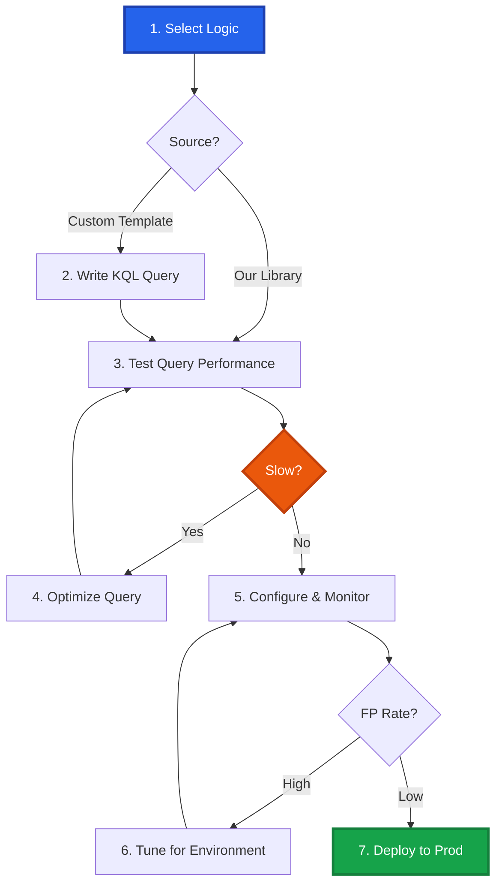

# Microsoft Defender KQL Detection Library

<div align="center">


[](https://azure.microsoft.com/services/azure-sentinel/)
[](https://attack.mitre.org/)

**Enterprise KQL Detection Logic & Engineering Toolkit**

*Curated by Mathan | Senior Security Engineer*

[🚀 Quick Start](#-quick-start) • [📁 Categories](#-detection-categories) • [📖 Documentation](#-detection-engineering-workflow) • [🤝 Contributing](#-contributing)

<!-- SEO: Microsoft Defender detection rules, KQL queries, Azure Sentinel analytics, threat detection, M365 security, advanced hunting queries, Kusto query language, security analytics, cloud security detection, identity threat detection, Microsoft 365 Defender, endpoint detection, email security rules, MITRE ATT&CK Microsoft, detection engineering, SOC automation, threat hunting KQL, Azure AD security, Office 365 security, incident detection, security operations, KQL analytics -->

</div>

---

## 📋 Overview

This repository provides **production-ready KQL detection rules** and **cloud-native detection methodology**:

1.  **📚 Production Detection Library**: Battle-tested KQL analytics for Microsoft's integrated security platform, covering endpoint, identity, email, and cloud threats across Defender XDR and Azure Sentinel.
2.  **🛠️ Detection Engineering Reference**: Proven KQL patterns demonstrating professional analytics rule development, query optimization, and cloud-scale detection standards.

**Repository Value:** *Deploy our KQL analytics immediately, optimize for your M365/Azure environment, or reference our proven patterns when building custom cloud-native detections.*

### Key Features
✅ **Multi-platform** - Defender XDR, Defender for Endpoint, Azure Sentinel  
✅ **Cloud-native** - Optimized for M365 and Azure environments  
✅ **Identity-focused** - Azure AD and OAuth attack detection  
✅ **Automated** - Ready for analytics rules and Logic Apps  
✅ **MITRE-aligned** - Comprehensive ATT&CK coverage

---

## 📁 Detection Categories

**8 categories** optimized for Microsoft's security ecosystem:

<table>
<tr>
<td width="25%" align="center">
<h3>🔐 Authentication</h3>
<b>Identity Attack Detection</b><br/>
<sub>Impossible Travel • Password Spray • MFA</sub>
</td>
<td width="25%" align="center">
<h3>💻 Endpoint</h3>
<b>Defender for Endpoint</b><br/>
<sub>Malware • LOLBins • Process Injection</sub>
</td>
<td width="25%" align="center">
<h3>🌐 Network</h3>
<b>Network Anomalies</b><br/>
<sub>C2 • Suspicious Connections</sub>
</td>
<td width="25%" align="center">
<h3>☁️ Cloud</h3>
<b>Azure & M365 Security</b><br/>
<sub>Privilege Escalation • API Abuse</sub>
</td>
</tr>
<tr>
<td width="25%" align="center">
<h3>📧 Mail</h3>
<b>Defender for Office 365</b><br/>
<sub>Phishing • BEC • Email Rules</sub>
</td>
<td width="25%" align="center">
<h3>🌍 Web</h3>
<b>Browser & Web Threats</b><br/>
<sub>Drive-by Downloads • Malicious Extensions</sub>
</td>
<td width="25%" align="center">
<h3>📊 Data</h3>
<b>DLP & Exfiltration</b><br/>
<sub>Cloud Storage • Mass Downloads</sub>
</td>
<td width="25%" align="center">
<h3>👤 Identity</h3>
<b>Azure AD & IAM</b><br/>
<sub>OAuth Abuse • Role Changes</sub>
</td>
</tr>
</table>

---

## 🚀 Quick Start

### Prerequisites
- Microsoft 365 E5 / A5, OR Microsoft Defender for Endpoint Plan 2 + Azure AD Premium P2
- Access to Defender XDR (`security.microsoft.com`) or Azure Sentinel

### How to Use This Library

#### Option A: Deploy Production Analytics (Recommended) ⚡
1.  **Browse** detection categories (e.g., `Authentication/T1078_Impossible_Travel.kql`).
2.  **Copy** the production-ready KQL query.
3.  **Validate** in your environment:
    *   **Defender XDR:** **Hunting** → **Advanced Hunting**
    *   **Azure Sentinel:** **Logs** workspace
4.  **Deploy** as Analytics Rule or Custom Detection policy.

#### Option B: Adapt for Your Environment (Flexible) 🛠️
1.  **Start** with a production KQL rule from the library.
2.  **Optimize** for your M365/Azure environment:
    *   Adjust identity filters for your tenant
    *   Add device naming conventions
    *   Modify thresholds based on your baseline
3.  **Reference** the `templates/` directory for KQL pattern examples.

#### Option C: Contribute Back (Community) 🤝
1.  **Fork** this repository.
2.  **Contribute** improved KQL logic or new detection rules.
3.  **Submit** a Pull Request with query performance metrics and testing results.

---

## 📖 Detection Engineering Workflow

Whether you are using our rules or building your own, we recommend this standard workflow:



### 1. The Logic Core (KQL)
Efficient KQL usage is critical for cloud-scale data.

**Example Logic:**
```kql
let timeframe = 24h;
SigninLogs
| where TimeGenerated >= ago(timeframe)
| where ResultType == "0"
| project TimeGenerated, UserPrincipalName, IPAddress, Location
| order by UserPrincipalName, TimeGenerated asc
| serialize
| extend prev_location = prev(Location)
| where UserPrincipalName == prev(UserPrincipalName) and Location != prev_location
// [logic continues to calculate impossible travel]
```

### 2. Testing & Validation
Use **Event-Horizon** (our sister project) or Microsoft's own Attack Simulator.

**Recommended Tool:** [Event-Horizon](https://github.com/PrototypePrime/Event_Horizon)

---

## 📊 Essential Tables

| Table | Data Source | Common Use Cases |
|-------|-------------|------------------|
| `SigninLogs` | Azure AD | Authentication attacks, impossible travel |
| `DeviceProcessEvents` | MDE | Process execution, command lines |
| `DeviceNetworkEvents` | MDE | Network connections, C2 detection |
| `EmailEvents` | MDO | Phishing, BEC, email threats |
| `CloudAppEvents` | MDCA | SaaS app activity, file operations |

---

## 🤝 Contributing

We welcome contributions! If you've created a rule using our templates or optimized one of ours:

1.  **Fork** this repository.
2.  **Create** a feature branch.
3.  **Submit** a Pull Request with your detection logic and testing results.

---

## 👤 About

### Implementation & Maintenance
**PrototypePrime (Mathan Subbiah)**  
*Senior Security Engineer | Detection Engineering Specialist*

Focused on cloud and identity threat detection for Microsoft security stack.

[](https://github.com/PrototypePrime)
[](https://www.linkedin.com/in/mathan-subbiah-0bb47aa8/)
[](mailto:mathan1702@gmail.com)

### Related Projects
- [Event-Horizon](https://github.com/PrototypePrime/Event_Horizon) - Production-quality security log generator
- [Splunk SPL Detection](https://github.com/PrototypePrime/Splunk_SPL_Detection)
- [Cortex XDR XQL Detection](https://github.com/PrototypePrime/Cortex_XDR_XQL_Detection)

---

## 📄 License
MIT License - see [LICENSE](LICENSE) file for details.

<div align="center">

### ⭐ Star This Repository!
*Help the community discover these KQL detection rules*


</div>
